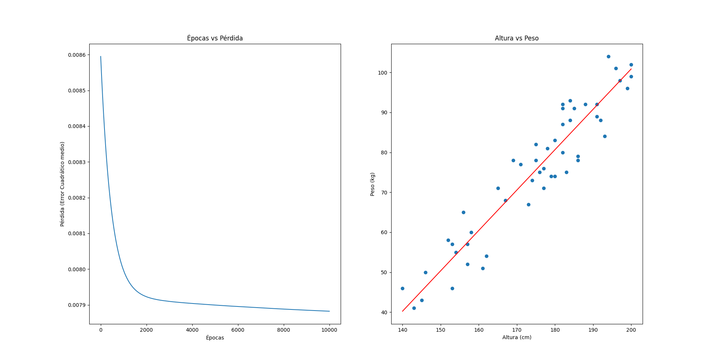

# Práctica de regresión lineal con Keras

## Objetivo

Desarrollar un script en Python que implemente un modelo de Regresión Lineal utilizando
Keras, basado en un conjunto de datos que incluye altura y peso de personas. El modelo
debe permitir encontrar la relación entre la altura y el peso, realizar predicciones y visualizar
los resultados.

## Gráficos e interpretación



El gráfico de la izquierda representa la pérdida (loss) del modelo durante el entrenamiento, según el número de épocas. Se puede observar que la pérdida disminuye a medida que se incrementa el número de épocas, pero que llega en un punto en que la disminución es mínima y la pérdida se estabiliza.

El gráfico de la derecha representa, por medio de un gráfico de dispersión, los datos de altura y peso de las personas, así como la línea de regresión lineal obtenida por el modelo. Se puede observar que la línea de regresión se ajusta a los datos de manera adecuada, lo que indica que el modelo ha aprendido correctamente la relación entre la altura y el peso. No sólo eso, sino que la línea de regresión se asemeja en forma a los datos reales, lo que indica que _la relación entre la altura y el peso de las personas es aproximadamente lineal, con un alto grado de confianza_. Esto quiere decir que _podemos confiar_, con un margen moderado de error, en las predicciones realizadas por el modelo, para esta situación específica.

## Instrucciones

1. Primero, cree un entorno virtual de Python usando `venv`:

```bash
python3 -m venv venv
```

2. Active el entorno virtual:

```bash
source venv/bin/activate
```

3. Instale las dependencias del proyecto:

```bash
pip install -r requirements.txt
```

4. Ejecute el script `main.py`:

```bash
python main.py
```
